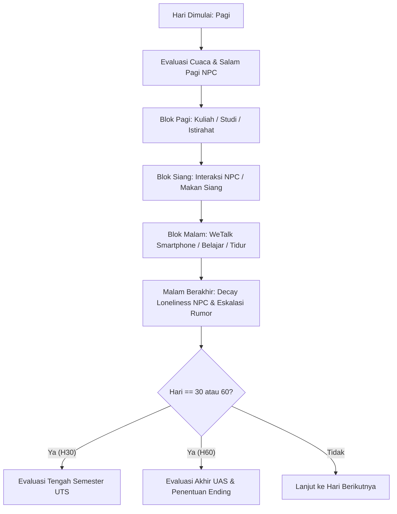
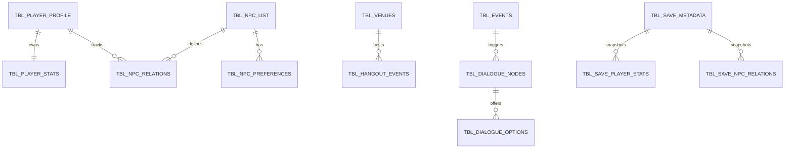

# Visual Novel Style Educational Social Simulation
### *A Relational SQLite-Driven Life Simulation & Game Balancing Framework in Unity 6*

[](https://unity.com/)
[](https://unity.com/srp/universal-render-pipeline)
[](https://www.sqlite.org/)
[](https://learn.microsoft.com/en-us/dotnet/csharp/)
[-brightgreen?style=flat-square)](#boundary-value-analysis-bva-testing)
[](#headless-balancing-simulation-60-day-calendar)
[](README_ID.md)

---

## 📌 Executive Summary

**Tokimeki-TA** is an educational life-simulation game built with **Unity 6 (6000.3.16f1)** and **URP (Universal Render Pipeline)**. Inspired by the classic mechanics of Konami's *Tokimeki Memorial* franchise, the game models the complex daily journey of **Devano Baskara Pratama**, an Indonesian international student studying Software Engineering on an academic exchange in China.

The project features a **fully normalized, embedded SQLite relational database** powering game state, declarative event evaluations, multi-slot save/load persistence, dynamic morning greetings, smartphone intel networks, and branching narrative dilemmas. 

Beyond its gameplay loop, the repository serves as an **academic engineering thesis benchmark** containing:
1. **Automated Headless 60-Day Balancing Simulator** evaluating 4 core player archetypes (*Study-Heavy*, *Social-Heavy*, *Balanced*, *Rest-Heavy*) across 240+ telemetry snapshots.
2. **Black-Box Boundary Value Analysis (BVA) Test Suite** with 44 deterministic test cases evaluating condition boundaries with a **100% pass rate**.
3. **In-Editor Analytics GUI & Telemetry Exporter** for live telemetry visualization and metric aggregation.

> 📖 **Catatan Bahasa Indonesia**: Untuk laporan teknis lengkap, metodologi skripsi, dan evaluasi Bab 4, silakan membaca [README_ID.md](README_ID.md) serta dokumen di folder [Documents/](Documents/README.md).

---

## 🎮 Core Gameplay Mechanics

The game revolves around balancing **Physical Health (PH)**, **Mental Health (MH)**, **Academic Competencies**, and **Interpersonal Guanxi (Relationships)** across a 60-day calendar cycle leading to Midterm (UTS, Day 30) and Final Examinations (UAS, Day 60).



### 1. Tri-Block Time Management & Vitality System
- **3 Daily Time Blocks**: *Pagi* (Morning), *Siang* (Afternoon), and *Malam* (Evening).
- **Physical Health (PH) & Mental Health (MH)** (Scale: 0 – 100):
  - Every activity exerts physiological or cognitive costs.
  - **Burnout State**: Triggered when either PH $\le 10$ or MH $\le 10$. In burnout, study productivity drops drastically, dialogue options are constrained, and negative mood events trigger.

### 2. Dual Academic Competence Model
- **Language Proficiency (Mandarin)**: Essential for social diplomacy and understanding complex lecture materials.
- **Cultural Etiquette (*Mianzi* / Kesantunan Budaya)**: Governs reputation and reduces friction during delicate social exchanges.
- **Academic Theory & Academic Practice**: Tested at the Day 30 Midterm Evaluation (Requirement: Theory $\ge 50$, Practice $\ge 45$) and Day 60 Final Evaluation.

### 3. Guanxi, Loneliness Decay & Tokimeki Rumor Bomb Mechanics
- **Guanxi Score (0 – 100)**: Quantitative relationship strength per NPC.
- **Affection State Spectrum**:
  - `0: Cold` $\rightarrow$ `1: Neutral` $\rightarrow$ `2: Friendly` $\rightarrow$ `3: Tokimeki` (Special morning encounters & exclusive weekend invitations).
- **Loneliness Decay & Bomb Escalation**:
  - Each NPC has a personal `base_decay_rate` (2 to 5 points/day).
  - Neglecting an NPC increases their `loneliness_meter`. If unchecked ($\ge 75$), campus rumors ignite.
  - **Global Rumor Levels (0 to 5)**: High rumor levels trigger social isolation, penalize academic confidence, and destroy relationship progress if not diffused via WeTalk or outings.

### 4. WeTalk Smartphone & Weekend Hangouts
- **Edelweiss Intel Broker ("Yoshio Mechanic")**: Call senior student Edelweiss to check character radars, secret hobbies, food preferences, sensitive topics, and rumor warnings.
- **Weekend Outings**: Invite NPCs to 5 distinct venues (*Kantin Halal*, *Distrik Elektronik*, *Kedai Teh*, *Perpustakaan*, *Kafe Boba*). Matching the venue to character preferences yields bonus Guanxi, while bad choices trigger social dilemmas.

---

## 👥 Character Cast & Profiles

| Portrait / Character | Role & Faculty | Birthday & Zodiac | Likes / Favorite Gift | Dislikes / Phobia Trigger | Special Talent |
| :--- | :--- | :---: | :--- | :--- | :--- |
| **Devano Baskara Pratama**<br>*(Protagonist)* | Software Engineering Exchange Student (Indonesia) | 15 Mei<br>*(Taurus)* | Masakan Indonesia,<br>Kotak P3K | Acrophobia<br>*(Takut Ketinggian)* | Adaptive Programming & Cooking |
| **Xiang Bai (向白)** | IT Professor & Academic Advisor | 18 Januari<br>*(Capricorn)* | Teh Longjing Tradisional | Phonophobia<br>*(Suara Keras Mendadak)* | Data Analytics & Academic Mentorship |
| **Li Haoran (李浩然)** | Senior IT Lab Techie | 11 Februari<br>*(Aquarius)* | Baozi Hangat & Kopi,<br>Hardware Modding | Suasana Kaku Formal,<br>Baterai Drop | Reverse Engineering & Kernel Hacking |
| **Yang Mei (杨梅)** | High-Achieving Arts & Literature Student | 19 September<br>*(Virgo)* | Masakan Rumahan,<br>Teh Krisan | Astraphobia<br>*(Badai Petir)* | Viola / Piano Performance & Calligraphy |
| **Edelweiss Mayori Lenathea** | Senior Double-Degree & Campus Info Broker | 12 Juli<br>*(Cancer)* | Boba Brown Sugar,<br>Permen Susu Karamel | Phonophobia Ringan<br>*(Pintu Terbanting)* | Information Brokerage & Course Summaries |

---

## 🏛️ System Architecture & Database Design

The project employs an **embedded relational SQLite architecture** (`Assets/StreamingAssets/game_database.db`) paired with an in-memory caching layer managed by [DatabaseManager.cs](file:///d:/Folder%20dio/Porto/My%20project%20(1)/Assets/Scripts/Database/DatabaseManager.cs).



### Relational Schema Breakdown
- **Master Tables**: `tbl_player_profile`, `tbl_player_stats`, `tbl_npc_list`, `tbl_npc_relations`, `tbl_venues`, `tbl_npc_preferences`, `tbl_events`, `tbl_morning_greetings`.
- **Branching Narrative Nodes**: `tbl_dialogue_nodes` and `tbl_dialogue_options` (storing stat prerequisites, moral dilemmas, and multi-attribute delta rewards).
- **Multi-Slot Transactional Save System**: `tbl_save_metadata`, `tbl_save_player_stats`, `tbl_save_npc_relations`, `tbl_save_story_flags`, `tbl_save_game_events`, `tbl_save_character_events`.
- **Telemetry & Logging**: `tbl_telemetry_logs`, `tbl_telemetry_snapshots`.

### Core Source Code Map

```
Assets/Scripts/
├── Core/
│   ├── GameManager.cs                   # Game loop, calendar progression, day-phase state machine
│   ├── PlayerStats.cs                   # Runtime stats, vitality bounds, Burnout flags
│   ├── SocialManager.cs                 # Guanxi cache, loneliness decay, global rumor propagation
│   ├── EventManager.cs                  # Declarative event inference engine (BVA target)
│   ├── GameEvent.cs                     # Event condition DTO & evaluator contracts
│   ├── FlagManager.cs                   # Bitwise/relational story & game state flags
│   ├── SaveManager.cs                   # Multi-slot transactional SQLite persistence
│   ├── RelationshipProgressionManager.cs# Milestones, affection thresholds & ending triggers
│   ├── MorningGreetingManager.cs        # Dynamic morning greeting event selector
│   ├── PhoneOutingManager.cs            # Edelweiss radar & weekend outing logic
│   ├── AcademicEvaluationSystem.cs      # Midterm & Final Exam evaluation algorithms
│   ├── BurnoutSystem.cs                 # Physical & mental exhaustion state handlers
│   ├── WeatherSystem.cs                 # Weather state generator & vitality impact
│   ├── TelemetryLogger.cs               # CSV/SQLite analytics snapshot logger
│   └── ActivitySimulator.cs             # Fast manual playtest & hotkey dispatch
├── Database/
│   └── DatabaseManager.cs               # SQLite connection lifecycle & schema migration
├── Dialogue/
│   ├── DialogueManager.cs               # Typewriter visual novel dialogue parser
│   ├── DialogueOption.cs                # Interactive choice handler
│   ├── DialogueBacklogManager.cs        # Dialogue history backlog collector
│   └── DialogueIdConstants.cs           # Centralized dialogue ID definitions
├── UI/
│   ├── MainMenuController.cs            # Main menu, animated background, load slot cards
│   ├── HUDController.cs                 # Top-bar stats, time display, weather, toasts
│   ├── PhoneUIController.cs             # Interactive smartphone / WeTalk app UI
│   ├── DialogueUIController.cs          # VN dialogue box, character names, portraits
│   ├── DialogueBacklogUI.cs             # Scrollable backlog history modal
│   ├── NPCRelationCardUI.cs             # NPC relation cards with affection progress bars
│   └── ActivityButtonHandler.cs         # Activity buttons & predictive hover tooltips
└── Editor/
    ├── AutomatedBalancingSimulator.cs   # Headless 60-day archetype batch simulator
    ├── BalancingAnalyticsWindow.cs      # In-Editor telemetry visualization & reports
    ├── EventConditionTestRunner.cs      # Black-Box Boundary Value Analysis (BVA) runner
    ├── CanvasHierarchyBuilder.cs        # Programmatic UI hierarchy generator
    ├── MainMenuSceneBuilder.cs          # Programmatic pastel Main Menu generator
    └── TokimekiIntegrityValidator.cs    # Static integrity checker for DB & scenes
```

---

## 🧪 Testing & Academic Evaluation (Bab 4 Skripsi)

The project includes comprehensive verification tools designed to satisfy the rigorous empirical standards of an undergraduate thesis (*Tugas Akhir*).

### 1. Boundary Value Analysis (BVA) Testing
A black-box testing harness ([EventConditionTestRunner.cs](file:///d:/Folder%20dio/Porto/My%20project%20(1)/Assets/Scripts/Editor/EventConditionTestRunner.cs)) executes boundary tests ($N-1, N, N+1$) against `EventManager.EvaluateConditions()`.

- **Test Suite Results**: **44 / 44 PASSED (100% Accuracy)**
- **Report**: [Documents/Laporan_Pengujian_BVA.md](file:///d:/Folder%20dio/Porto/My%20project%20(1)/Documents/Laporan_Pengujian_BVA.md) | [Laporan_Pengujian_BVA.csv](file:///d:/Folder%20dio/Porto/My%20project%20(1)/Documents/Laporan_Pengujian_BVA.csv)

| Category | Parameters Tested | Boundary Cases ($N-1, N, N+1$) | Result |
| :--- | :--- | :--- | :---: |
| **Player Attributes** | Language, Etiquette, Physical Health, Mental Health (Min & Max) | 39, 40, 41 / 29, 30, 31 / 19, 20, 21 / 79, 80, 81 | **PASS** |
| **Academics** | Theory, Practice | 49, 50, 51 | **PASS** |
| **Social Dynamics** | Guanxi (Haoran), Affection State (Neutral $\rightarrow$ Tokimeki) | 59, 60, 61 / State 1, 2, 3 | **PASS** |
| **Environmental** | Global Rumor (Lv 0 $\rightarrow$ 2), Day Range (10 $\rightarrow$ 20), TimeBlock, DayType | Mismatch vs Match Boundary | **PASS** |
| **Story Progression** | Declarative Story Flags | Null (0) vs Value $\ge 1$ | **PASS** |

### 2. Headless Balancing Simulation (60-Day Calendar)
An automated headless simulator ([AutomatedBalancingSimulator.cs](file:///d:/Folder%20dio/Porto/My%20project%20(1)/Assets/Scripts/Editor/AutomatedBalancingSimulator.cs)) executed 4 player archetypes across full 60-day lifecycles (240 daily snapshots) to prove the absence of degenerate strategies or unavoidable softlocks.

- **Full Report**: [Documents/Laporan_Simulasi_Balancing_60Hari.md](file:///d:/Folder%20dio/Porto/My%20project%20(1)/Documents/Laporan_Simulasi_Balancing_60Hari.md)
- **Aggregated Report**: [Documents/Laporan_Balancing_Bab4.md](file:///d:/Folder%20dio/Porto/My%20project%20(1)/Documents/Laporan_Balancing_Bab4.md)
- **Telemetry Datasets**: [Documents/Analytics/](file:///d:/Folder%20dio/Porto/My%20project%20(1)/Documents/Analytics/)

| Archetype | UTS (Day 30) | UAS (Day 60) | Theory / Practice | Language | Avg Guanxi | Max Loneliness | Rumor Peak | Burnout Days | Behavior Analysis |
| :--- | :---: | :---: | :---: | :---: | :---: | :---: | :---: | :---: | :--- |
| **StudyHeavy** | `PASS` | Sangat Memuaskan | 100 / 100 | 100 | 0.0 | 100 | Level 5 | 56 Days | Blind academic grinding triggers severe physiological burnout and rumor detonation. |
| **SocialHeavy** | `PASS` | Lulus Memuaskan | 100 / 100 | 20 | 68.0 | 20 | Level 0 | 0 Days | Zero burnout and highest Guanxi, but language proficiency remains at baseline. |
| **Balanced** | `PASS` | Lulus Memuaskan | 100 / 100 | 20 | 7.5 | 70 | Level 0 | 0 Days | **Golden Path**: Adaptive study/rest/social cycle prevents rumors and ensures peak health. |
| **RestHeavy** | `PASS` | Lulus Memuaskan | 100 / 100 | 20 | 0.0 | 100 | Level 5 | 0 Days | Passive survival: 100% vitality, but total social decay and campus isolation. |

### 3. Fundamental Balancing Metrics
Evaluated over 90 active simulation snapshots against predefined ideal thresholds:

| Metric | Measured Value | Ideal Threshold | Status | Academic Verdict |
| :--- | :---: | :---: | :---: | :--- |
| **Stat Growth Rate** | +3.83 pts/day | +1.5 to +6.0 pts/day | **Optimal** | Progression curve avoids excessive grinding while rewarding consistency. |
| **Burnout Frequency** | 3.3% | $\le$ 15.0% | **Optimal** | Opportunity cost penalties enforce meaningful sleep/rest planning. |
| **Rumor Level 2+ Rate** | 20.0% | $\le$ 25.0% | **Optimal** | Provides adequate social friction without unfairly sabotaging the player. |
| **Max Loneliness Peak** | 54 / 100 | $\le$ 75 pts | **Optimal** | Decay rate (-2/day) successfully incentivizes regular NPC interaction rotation. |
| **Event Trigger Rate** | 17.8% | 10.0% – 30.0% | **Optimal** | Dynamic story cadence balances narrative surprises with player autonomy. |
| **Average Vitality** | PH: 84.9 / MH: 86.9 | $\ge$ 40.0 pts | **Healthy** | Players retain agency without softlock traps under standard play. |

---

## 🎬 Narrative Endings (6 Outcomes)

The game features 6 distinct narrative endings unlocked by satisfying specific academic milestones, affection states, and story flags at the end of Day 60:

1. `END_XIANG_BAI` — **Ikatan Akademik & Mentor Sejati**: Mentorship recommendation for long-term postgraduate research scholarship.
2. `END_LI_HAORAN` — **Duo Pengembang Perangkat Lunak**: Cross-border tech startup partnership between Haoran and Devano.
3. `END_YANG_MEI` — **Resonansi Hati di Kota Asing**: Romantic farewell with a reciprocal promise to visit each other across borders.
4. `END_EDELWEISS` — **Kemitraan Hangat Dua Perantau**: Warm cross-cultural bond with a promise to reunite during Indonesian holidays.
5. `END_SOLO_ACADEMIC` — **Penyelesaian Studi Cum Laude**: Graduating with flawless academic honors without deep social ties.
6. `END_DEFAULT_RETURN` — **Akhir Masa Pertukaran Pelajar**: Returning home safely with a rich portfolio of cultural adaptation experiences.

---

## ⌨️ Controls & Playtesting Shortcuts

### Normal Gameplay Controls
- **Mouse Left-Click**: Interact with UI buttons, select activities, choose dialogue options, navigate smartphone apps.
- **Space / Enter**: Advance typewriter dialogue text.
- **Escape**: Close modals / Exit dialogue backlog.

### In-Editor Debug & Balancing Hotkeys (`#if UNITY_EDITOR`)
Defined in [ActivitySimulator.cs](file:///d:/Folder%20dio/Porto/My%20project%20(1)/Assets/Scripts/Core/ActivitySimulator.cs) and [SaveManager.cs](file:///d:/Folder%20dio/Porto/My%20project%20(1)/Assets/Scripts/Core/SaveManager.cs):

| Key | Action | Description |
| :---: | :--- | :--- |
| <kbd>1</kbd> | Quick Action: Study Mandarin | Adds Language (+15), expends Mental (-10) & Physical (-5), shifts time. |
| <kbd>2</kbd> | Quick Action: Lunch with Haoran | Increases Guanxi (+10), reduces Loneliness (-30), shifts time. |
| <kbd>Space</kbd> | Skip Time Slot | Shifts time to the next slot without social action. |
| <kbd>D</kbd> | Trigger Advisor Dialogue | Starts dialogue node 1001 (Progress Report to Prof. Xiang Bai). |
| <kbd>Enter</kbd> | Select Dialogue Option 1 | Advances the first active dialogue branch. |
| <kbd>F1</kbd> | Debug Preset: Route C | Sets Language 20, Etiquette 15 (Tests low-stat failure branch). |
| <kbd>F2</kbd> | Debug Preset: Route B | Sets Language 40, Etiquette 20 (Tests *Mianzi* / etiquette check). |
| <kbd>F3</kbd> | Debug Preset: Route A | Sets Language 40, Etiquette 60 (Tests full success branch). |
| <kbd>F4</kbd> | Trigger Burnout Test | Depletes PH & MH by -100 to test exhaustion state handling. |
| <kbd>F5</kbd> | Quick Save | Instantly saves current state to Slot 1 in SQLite database. |
| <kbd>F6</kbd> | Quick Load | Instantly restores state from Slot 1 in SQLite database. |
| <kbd>F8</kbd> | Evaluate Events Instantly | Evaluates all event conditions via `EventManager.TryTriggerEligibleEvent()`. |
| <kbd>F9</kbd> | Headless Sim: Study-Heavy | Runs 60-day automated headless simulation for Pure Academic archetype. |
| <kbd>F10</kbd> | Headless Sim: Social-Heavy | Runs 60-day automated headless simulation for Pure Social archetype. |
| <kbd>F11</kbd> | Headless Sim: Balanced | Runs 60-day automated headless simulation for Balanced archetype. |
| <kbd>F12</kbd> | Export Telemetry CSV | Manually exports runtime telemetry logs to CSV file. |

---

## 🛠️ Unity Editor Tools (`Tokimeki TA` Menu)

The project equips game designers and thesis examiners with custom Unity Editor windows accessible from the menu bar:

```
Tokimeki TA / Game Debug / Game Database
├── Event Condition Test Runner           # GUI runner for 44 BVA test cases with instant PASS/FAIL badges
├── Balancing Analytics Reporter         # Interactive multi-chart telemetric analysis visualizer
├── Headless Balancing Simulator         # Multi-archetype 60-day batch simulation window
├── Export All Archetype Datasets        # Batch headless export generating all CSV files to Analytics/
├── Jalankan Validasi Integritas Tokimeki# Verifies scene hierarchy, DB connection, and asset links
├── Build Main Menu Scene (Pastel Style) # Programmatically regenerates the Main Menu scene
├── Build HUD Canvas Hierarchy           # Programmatically regenerates in-game HUD and tooltips
├── Build Smartphone UI                  # Programmatically regenerates WeTalk smartphone UI
└── Terapkan Migrasi Fitur Smartphone   # Idempotent SQLite schema migration tool
```

---

## 🚀 Getting Started & Installation

### Prerequisites
- **Unity Version**: Unity 6 LTS (`6000.3.16f1` or compatible Unity 6 release).
- **Unity Modules**: Universal Render Pipeline (URP), TextMesh Pro, Input System (com.unity.inputsystem).
- **Operating System**: Windows 10 / 11 (tested on x64).

### Setup Instructions
1. **Clone the Repository**:
   ```bash
   git clone https://github.com/Rytsia1/Tokimeki-TA.git
   ```
2. **Open with Unity Hub**:
   - Launch Unity Hub.
   - Click **Add** $\rightarrow$ **Add project from disk**.
   - Select the cloned project folder and ensure the editor version is set to `6000.3.16f1`.
3. **Database Initialization**:
   - The master database resides at `Assets/StreamingAssets/game_database.db`.
   - On first launch, `DatabaseManager.cs` automatically copies the database to `Application.persistentDataPath` and executes schema validation.
4. **Running the Game**:
   - In the **Project Window**, navigate to `Assets/Scenes/`.
   - Open [MainMenuScene.unity](file:///d:/Folder%20dio/Porto/My%20project%20(1)/Assets/Scenes/MainMenuScene.unity).
   - Press the **Play** button in the Unity Editor.
   - Click **Mulai Petualangan** (New Game) or select a save slot to enter `SampleScene.unity`.

---

## 📁 Repository Structure

```
├── .vscode/                             # Editor workspace configurations
├── Analytics/                           # Raw telemetry CSV outputs from 60-day simulations
│   ├── telemetry_dataset_all_archetypes.csv
│   ├── telemetry_dataset_studyheavy.csv
│   ├── telemetry_dataset_socialheavy.csv
│   ├── telemetry_dataset_balanced.csv
│   └── telemetry_dataset_restheavy.csv
├── Assets/
│   ├── Fonts/                           # Typography & font assets
│   ├── Prefabs/                         # Reusable UI cards & components
│   ├── Scenes/                          # MainMenuScene & SampleScene
│   ├── Scripts/                         # Core, Database, Dialogue, UI & Editor logic
│   ├── StreamingAssets/                 # Master SQLite database (game_database.db)
│   ├── TextMesh Pro/                    # TMP resources & fallback font definitions
│   └── Textures/                        # Visual novel portraits, backgrounds, icons
├── Documents/                           # Academic thesis reports & evaluation benchmarks
│   ├── Analytics/                       # Telemetry datasets copy for academic review
│   ├── Laporan_Balancing_Bab4.md        # Comprehensive Bab 4 Game Balancing Report
│   ├── Laporan_Balancing_Bab4.csv       # 6 fundamental balancing metrics in CSV
│   ├── Laporan_Pengujian_BVA.md         # 44 Black-Box Boundary Value Analysis cases
│   ├── Laporan_Pengujian_BVA.csv        # BVA test suite dataset
│   ├── Laporan_Simulasi_Balancing_60Hari.md # 60-Day Headless Simulation Analysis
│   └── README.md                        # Documentation & evaluation directory index
├── ProjectSettings/                     # Unity engine project settings (Unity 6)
├── README.md                            # Primary flagship repository README (English)
└── README_ID.md                         # Laporan & Dokumentasi Lengkap (Bahasa Indonesia)
```

---

## 📚 Academic Citation & Acknowledgments

This project was developed as an undergraduate thesis (*Tugas Akhir*) research artifact in Informatics / Computer Science:

- **Repository**: [https://github.com/Rytsia1/Tokimeki-TA](https://github.com/Rytsia1/Tokimeki-TA)
- **Author**: Dio ([@Rytsia1](https://github.com/Rytsia1))
- **Email Contact**: `dioakazenith@gmail.com`
- **Academic Context**: Evaluasi Keseimbangan Sistem dan Desain Mekanika Game Simulasi Sosial Berbasis Relasional SQLite (*Tokimeki Memorial Style*).

---

## 📄 License

This project is licensed under the [MIT License](LICENSE) — free to use for academic, research, and non-commercial game development studies.
