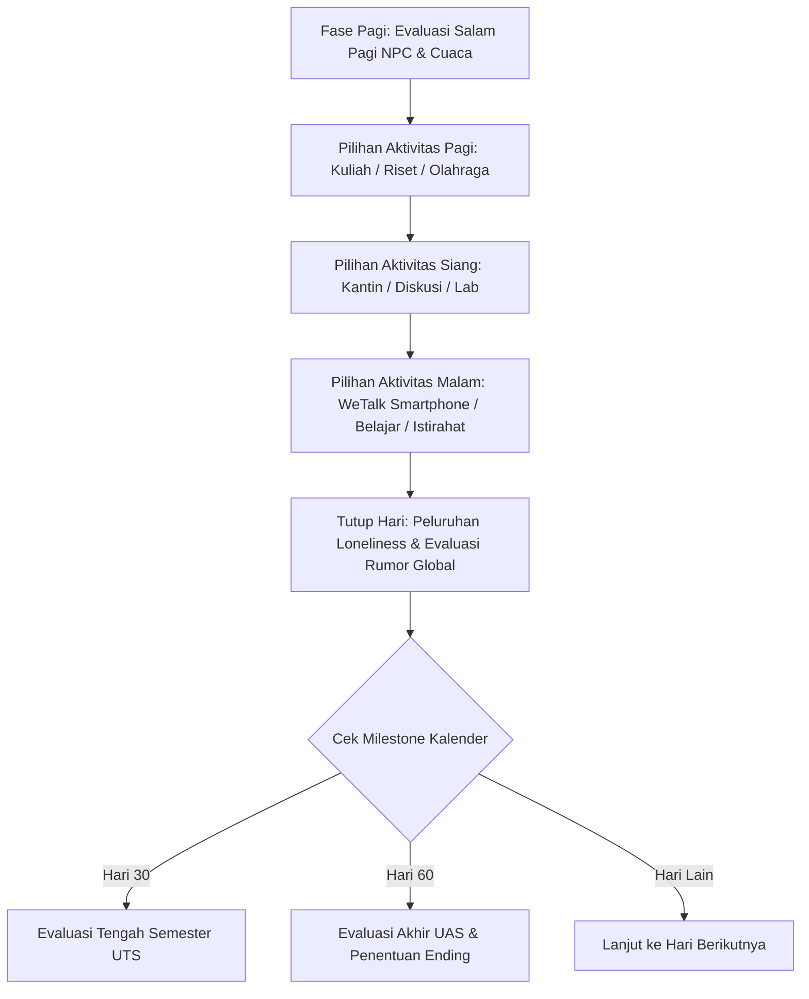
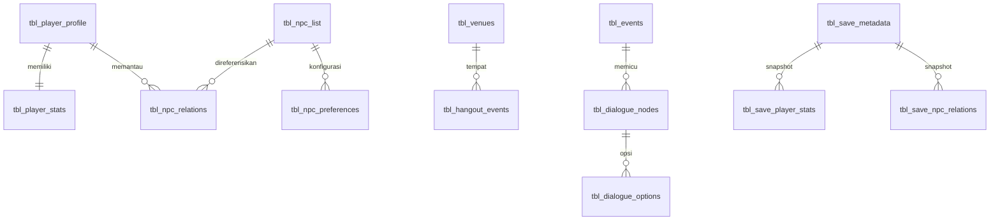

# Simulasi Relasi Sosial & Kehidupan Mahasiswa Internasional (Tokimeki-TA)
### *Implementasi Sistem Berbasis SQLite dan Evaluasi Keseimbangan Kuantitatif pada Unity 6*

[](https://unity.com/)
[](https://unity.com/srp/universal-render-pipeline)
[](https://www.sqlite.org/)
[](https://learn.microsoft.com/en-us/dotnet/csharp/)
[-brightgreen?style=flat-square)](#1-pengujian-black-box-boundary-value-analysis-bva)
[](#2-simulasi-keseimbangan-sistem-headless-60-hari)
[](README.md)

---

## 📖 1. Latar Belakang & Deskripsi Proyek

**Tokimeki-TA** adalah artefak perangkat lunak simulasi sosial dan manajemen waktu berbasis **Unity 6 (6000.3.16f1)** dan **Universal Render Pipeline (URP)** yang dikembangkan dalam rangka penelitian **Skripsi / Tugas Akhir (TA)** bidang Teknik Informatika / Ilmu Komputer.

Permainan ini mengadaptasi dan memodernisasi fondasi mekanika permainan legendaris *Tokimeki Memorial* (Konami) ke dalam konteks adaptasi sosial-budaya nyata seorang mahasiswa Indonesia bernama **Devano Baskara Pratama**, yang sedang menempuh program pertukaran akademik jurusan *Software Engineering* di Tiongkok.

Tantangan utama pemain berpusat pada paradoks keterbatasan waktu (*opportunity cost*):
1. Menuntut keunggulan akademik (Evaluasi Tengah Semester/UTS Hari ke-30 dan Ujian Akhir Semester/UAS Hari ke-60).
2. Mempelajari Bahasa Mandarin dan kesantunan etika budaya (*Mianzi* / 面子).
3. Menjaga vitalitas fisik (*Physical Health*) dan stabilitas psikologis (*Mental Health*) agar tidak terjerumus ke dalam kondisi **Burnout**.
4. Membangun dan merawat jaringan relasi (*Guanxi* / 关系) dengan dosen dan sesama rekan mahasiswa di tengah ancaman peluruhan relasi (*loneliness decay*) dan eskalasi rumor kampus (*rumor bomb mechanic*).

Seluruh kondisi dunia game, percabangan dialog visual novel, status relasi, profil karakter, hingga riwayat penyimpanan multi-slot dikelola secara deklaratif melalui **basis data relasional SQLite tertanam** (`game_database.db`).

---

## ⚙️ 2. Mekanika Inti Permainan (*Core Gameplay Mechanics*)



### A. Manajemen Waktu Tiga Blok & Sistem Vitalitas
- **Siklus Harian**: Terbagi menjadi 3 blok waktu operasional: **Pagi**, **Siang**, dan **Malam** selama 60 hari kalender.
- **Kesehatan Fisik (PH) & Kesehatan Mental (MH)** (Skala: 0 s.d. 100):
  - Setiap aktivitas belajar mandiri atau praktikum mengonsumsi energi fisik dan ketahanan mental.
  - **Kondisi Burnout**: Terpicu saat PH $\le 10$ atau MH $\le 10$. Karakter mengalami disorientasi, tidak dapat belajar mandiri secara efektif, dan memicu penalti sosial berkelanjutan hingga pemain beristirahat total.

### B. Dimensi Kompetensi Akademik
- **Kemahiran Bahasa (*Language Proficiency*)**: Menentukan keberhasilan komunikasi tingkat lanjut dan pemahaman materi praktikum.
- **Etika Budaya (*Cultural Etiquette / Mianzi*)**: Menguji kesadaran norma sopan santun lokal saat berinteraksi dengan dosen dan masyarakat sekitar.
- **Teori Akademik (*Theory*) & Praktik Lab (*Practice*)**: Tolok ukur kelulusan evaluasi UTS (Hari 30: Teori $\ge 50$, Praktik $\ge 45$) dan penentu predikat kelulusan UAS (Hari 60).

### C. Dinamika Relasi Guanxi, Peluruhan Kesepian, & Sistem Bom Rumor
- **Skor Guanxi (0 s.d. 100)**: Besaran afeksi dan kepercayaan timbal balik per NPC.
- **Tahapan Afeksi (*Affection State*)**:
  - `State 0 (Cold)` $\rightarrow$ `State 1 (Neutral)` $\rightarrow$ `State 2 (Friendly)` $\rightarrow$ `State 3 (Tokimeki)`.
  - Pada status *Tokimeki*, NPC menyapa pemain di koridor kampus pada pagi hari dan membuka opsi kencan eksklusif akhir pekan.
- **Peluruhan Kesepian (*Loneliness Decay*)**: Setiap hari NPC yang diabaikan akan mengalami penambahan meter kesepian sesuai `base_decay_rate` masing-masing (2 s.d. 5 poin/hari).
- **Mekanik Bom Rumor Kampus (*Rumor Bomb Escalation*)**:
  - Jika `loneliness_meter` NPC mencapai $\ge 75$, NPC tersebut merasa diabaikan dan memicu kabar burung negatif di lingkungan kampus.
  - **Level Rumor Global (Level 0 s.d. 5)**: Tingkat rumor tinggi menimbulkan friksi sosial masif, penurunan drastis Guanxi seluruh relasi, dan mengunci sejumlah opsi dialog penting.

### D. Fitur Smartphone WeTalk & Kencan Akhir Pekan (*Hangout*)
- **Radar Intel Edelweiss ("Yoshio Mechanic")**: Menghubungi Edelweiss Mayori Lenathea via ponsel untuk memeriksa tingkat kesepian karakter, makanan favorit, topik sensitif, serta status rumor aktif.
- **Kencan Akhir Pekan (*Outing*)**: Mengajak NPC ke 5 destinasi (*Kantin Halal*, *Distrik Elektronik*, *Kedai Teh Tradisional*, *Perpustakaan*, *Kafe Boba*). Kesesuaian lokasi dengan preferensi karakter menghasilkan lonjakan Guanxi dan meredakan kesepian secara instan.

---

## 👥 3. Profil Tokoh & Karakter

| Karakter | Peran & Latar Belakang | Ulang Tahun & Zodiak | Kesukaan / Kado Favorit | Pemicu Fobia / Hal yang Dibenci | Bakat Khusus |
| :--- | :--- | :---: | :--- | :--- | :--- |
| **Devano Baskara Pratama**<br>*(Protagonis)* | Mahasiswa Pertukaran Rekayasa Perangkat Lunak asal Indonesia | 15 Mei<br>*(Taurus)* | Masakan Indonesia,<br>Kotak P3K | Acrophobia<br>*(Ketinggian Ekstrem)* | Pemrograman Adaptif & Kuliner Tradisional |
| **Xiang Bai (向白)** | Dosen IT & Dosen Pembimbing Akademik | 18 Januari<br>*(Capricorn)* | Teh Hijau Longjing Tradisional | Phonophobia<br>*(Suara Keras Tiba-tiba)* | Analisis Data Riset & Pembinaan Karier |
| **Li Haoran (李浩然)** | Mahasiswa Senior Laboratorium IT | 11 Februari<br>*(Aquarius)* | Baozi Daging Hangat,<br>Kopi & Hardware Modding | Suasana Kaku Formal,<br>Baterai Drop Mendadak | *Reverse Engineering* & Modifikasi Kernel |
| **Yang Mei (杨梅)** | Mahasiswi Berprestasi Fakultas Sastra & Seni Budaya | 19 September<br>*(Virgo)* | Masakan Rumahan Sehat,<br>Teh Krisan | Astraphobia<br>*(Badai Petir)* | Resital Viola / Piano & Kaligrafi Tradisional |
| **Edelweiss Mayori Lenathea** | Senior Double-Degree & Pialang Informasi Kampus | 12 Juli<br>*(Cancer)* | Boba Brown Sugar,<br>Permen Susu Karamel | Phonophobia Ringan<br>*(Pintu Terbanting)* | Jaringan Intelijensi Kampus & Rangkuman Materi |

---

## 🗄️ 4. Arsitektur Perangkat Lunak & Skema Basis Data SQLite

Sistem dibangun menggunakan pola arsitektur *Component-Based Modular Engine* terintegrasi dengan basis data SQLite tertanam (`Assets/StreamingAssets/game_database.db`) yang dikendalikan oleh [DatabaseManager.cs](file:///d:/Folder%20dio/Porto/My%20project%20(1)/Assets/Scripts/Database/DatabaseManager.cs).



### Tabel-Tabel Utama Basis Data:
1. **Master Entitas**: `tbl_player_profile`, `tbl_player_stats`, `tbl_npc_list`, `tbl_npc_relations`, `tbl_venues`, `tbl_npc_preferences`.
2. **Sistem Event & Dialog**: `tbl_events`, `tbl_dialogue_nodes`, `tbl_dialogue_options`, `tbl_morning_greetings`, `tbl_hangout_events`, `tbl_story_flags`, `tbl_character_events`, `tbl_endings`.
3. **Penyimpanan Multi-Slot Transaksional**: `tbl_save_metadata`, `tbl_save_player_stats`, `tbl_save_npc_relations`, `tbl_save_story_flags`, `tbl_save_game_events`, `tbl_save_character_events`.
4. **Audit & Telemetri**: `tbl_telemetry_logs`, `tbl_telemetry_snapshots`.

---

## 📊 5. Evaluasi & Pengujian Sistem (Bab 4 Skripsi)

### 1. Pengujian Black-Box: Boundary Value Analysis (BVA)
Mesin inferensi kondisi event ([EventManager.cs](file:///d:/Folder%20dio/Porto/My%20project%20(1)/Assets/Scripts/Core/EventManager.cs)) diuji menggunakan metodologi **Boundary Value Analysis** dengan formula titik batas ($N-1, N, N+1$) melalui test runner otomatis [EventConditionTestRunner.cs](file:///d:/Folder%20dio/Porto/My%20project%20(1)/Assets/Scripts/Editor/EventConditionTestRunner.cs).

- **Total Kasus Uji**: 44 Kasus Uji
- **Tingkat Keberhasilan**: **100% PASS (44 / 44 Lolos)**
- **Dokumen Terkait**: [Documents/Laporan_Pengujian_BVA.md](file:///d:/Folder%20dio/Porto/My%20project%20(1)/Documents/Laporan_Pengujian_BVA.md) | [Laporan_Pengujian_BVA.csv](file:///d:/Folder%20dio/Porto/My%20project%20(1)/Documents/Laporan_Pengujian_BVA.csv)

| Parameter | Kasus Uji (BVA) | Nilai Input | Nilai Batas | Ekspektasi | Hasil Aktual | Status |
| :--- | :--- | :---: | :---: | :---: | :---: | :---: |
| **Language** | Bawah (N-1) / Batas (N) / Atas (N+1) | 39 / 40 / 41 | $\ge 40$ | FAIL / PASS / PASS | FAIL / PASS / PASS | **PASS** |
| **Etiquette** | Bawah (N-1) / Batas (N) / Atas (N+1) | 29 / 30 / 31 | $\ge 30$ | FAIL / PASS / PASS | FAIL / PASS / PASS | **PASS** |
| **Physical Health** | Bawah (N-1) / Batas (N) / Atas (N+1) | 29 / 30 / 31 | $\ge 30$ | FAIL / PASS / PASS | FAIL / PASS / PASS | **PASS** |
| **Mental Health (Min)** | Bawah (Min-1) / Batas (Min) / Atas (Min+1) | 19 / 20 / 21 | $\ge 20$ | FAIL / PASS / PASS | FAIL / PASS / PASS | **PASS** |
| **Mental Health (Max)** | Bawah (Max-1) / Batas (Max) / Atas (Max+1) | 79 / 80 / 81 | $\le 80$ | PASS / PASS / FAIL | PASS / PASS / FAIL | **PASS** |
| **Academic Theory** | Bawah (N-1) / Batas (N) / Atas (N+1) | 49 / 50 / 51 | $\ge 50$ | FAIL / PASS / PASS | FAIL / PASS / PASS | **PASS** |
| **Academic Practice** | Bawah (N-1) / Batas (N) / Atas (N+1) | 49 / 50 / 51 | $\ge 50$ | FAIL / PASS / PASS | FAIL / PASS / PASS | **PASS** |
| **Guanxi NPC (Haoran)** | Bawah (N-1) / Batas (N) / Atas (N+1) | 59 / 60 / 61 | $\ge 60$ | FAIL / PASS / PASS | FAIL / PASS / PASS | **PASS** |
| **Affection State** | Bawah (State 1) / Titik (State 2) / Atas (State 3) | 1 / 2 / 3 | $\ge \text{State } 2$ | FAIL / PASS / PASS | FAIL / PASS / PASS | **PASS** |
| **Global Rumor** | Bawah (Lv 0) / Titik (Lv 1) / Atas (Lv 2) | 0 / 1 / 2 | $\ge \text{Level } 1$ | FAIL / PASS / PASS | FAIL / PASS / PASS | **PASS** |
| **Day Range** | Titik Batas Bawah (9, 10, 11) & Atas (19, 20, 21) | Hari 9-21 | $10 \le \text{Day} \le 20$ | Deterministic Match | Deterministic Match | **PASS** |
| **Time Block / Day Type**| Evaluasi Kesesuaian Waktu & Tipe Hari | Pagi/Siang/Malam | Match Context | Deterministic Match | Deterministic Match | **PASS** |
| **Story Flag** | Flag Belum Terpasang (0) vs Terpasang ($\ge 1$) | 0 / 1 / 2 | $\ge 1$ | FAIL / PASS / PASS | FAIL / PASS / PASS | **PASS** |

### 2. Simulasi Keseimbangan Sistem Headless (60 Hari)
Pengujian keseimbangan matematika (*mathematical balance*) dilakukan tanpa GUI (*headless mode*) melalui [AutomatedBalancingSimulator.cs](file:///d:/Folder%20dio/Porto/My%20project%20(1)/Assets/Scripts/Editor/AutomatedBalancingSimulator.cs) terhadap 4 model gaya bermain pemain:

- **Dokumen Terkait**: [Documents/Laporan_Simulasi_Balancing_60Hari.md](file:///d:/Folder%20dio/Porto/My%20project%20(1)/Documents/Laporan_Simulasi_Balancing_60Hari.md)
- **Dataset CSV**: [Documents/Analytics/](file:///d:/Folder%20dio/Porto/My%20project%20(1)/Documents/Analytics/)

| Arketipe Perilaku | Status UTS (H30) | Predikat UAS (H60) | Teori / Praktik | Bahasa | Rata-rata Guanxi | Loneliness Tertinggi | Puncak Rumor | Total Hari Burnout |
| :--- | :---: | :---: | :---: | :---: | :---: | :---: | :---: | :---: |
| **StudyHeavy** | `LULUS` | Sangat Memuaskan | 100 / 100 | 100 | 0.0 | 100 | Level 5 | 56 Hari |
| **SocialHeavy** | `LULUS` | Lulus Memuaskan | 100 / 100 | 20 | 68.0 | 20 | Level 0 | 0 Hari |
| **Balanced** | `LULUS` | Lulus Memuaskan | 100 / 100 | 20 | 7.5 | 70 | Level 0 | 0 Hari |
| **RestHeavy** | `LULUS` | Lulus Memuaskan | 100 / 100 | 20 | 0.0 | 100 | Level 5 | 0 Hari |

### 3. Evaluasi 6 Metrik Balancing Fundamental
Berdasarkan agregasi 90 snapshot simulasi sesi permainan aktif ([Documents/Laporan_Balancing_Bab4.md](file:///d:/Folder%20dio/Porto/My%20project%20(1)/Documents/Laporan_Balancing_Bab4.md)):

| No | Metrik Balancing | Nilai Terukur | Ambang Batas Ideal | Status Kelayakan | Interpretasi Akademis |
| :---: | :--- | :---: | :---: | :---: | :--- |
| 1 | **Stat Growth Rate** | +3.83 poin/hari | +1.5 s.d. +6.0 pts/hari | **Optimal (Lolos)** | Akumulasi total stat bertambah +115 poin. Kurva belajar terbukti proporsional tanpa *grinding* berlebih. |
| 2 | **Burnout Frequency** | 3.3% | $\le$ 15.0% | **Optimal (Lolos)** | Terjadi 3 insiden kelelahan dari 90 aksi. Menuntut manajemen istirahat tanpa menyebabkan kemandekan permainan (*softlock*). |
| 3 | **Rumor Level 2+ Rate** | 20.0% | $\le$ 25.0% | **Optimal (Lolos)** | Friksi sosial muncul proporsional untuk mendorong rotasi interaksi dengan NPC. |
| 4 | **Max Loneliness Peak** | 54 / 100 | $\le$ 75 poin | **Optimal (Lolos)** | Puncak kesepian terkendali, memvalidasi mekanik peluruhan -2/hari berjalan stabil. |
| 5 | **Event Trigger Rate** | 17.8% | 10.0% s.d. 30.0% | **Optimal (Lolos)** | Sebanyak 16 event dipicu dari seluruh snapshot; ritme naratif berlangsung dinamis. |
| 6 | **Rata-Rata Vitalitas** | PH: 84.9 / MH: 86.9 | $\ge$ 40.0 poin | **Sehat (Lolos)** | Kebugaran fisik dan mental pemain berada di rentang aman sepanjang siklus semester. |

---

## 🏆 6. Daftar Akhir Cerita (*Narrative Endings*)

1. `END_XIANG_BAI` — **Ikatan Akademik & Mentor Sejati**: Rekomendasi beasiswa riset magister langsung dari Dosen Xiang Bai.
2. `END_LI_HAORAN` — **Duo Pengembang Perangkat Lunak**: Kemitraan perintisan startup teknologi lintas negara bersama Li Haoran.
3. `END_YANG_MEI` — **Resonansi Hati di Kota Asing**: Ikatan asmara mendalam dengan janji saling mengunjungi lintas benua.
4. `END_EDELWEISS` — **Kemitraan Hangat Dua Perantau**: Persahabatan sesama perantau dengan agenda reuni saat liburan di Indonesia.
5. `END_SOLO_ACADEMIC` — **Penyelesaian Studi Cum Laude**: Lulus dengan IPK sempurna dan kehormatan akademik tanpa ikatan sosial mendalam.
6. `END_DEFAULT_RETURN` — **Akhir Masa Pertukaran Pelajar**: Kembali ke Indonesia membawa segudang pelajaran hidup dan adaptasi lintas budaya.

---

## ⌨️ 7. Panduan Kontrol & Pintasan Uji (*Editor Hotkeys*)

### Kontrol Permainan Normal
- **Klik Kiri Mouse**: Memilih tombol aktivitas, navigasi dialog, berinteraksi dengan aplikasi WeTalk Smartphone.
- **Spasi / Enter**: Memajukan teks dialog bergaya visual novel.
- **Escape**: Menutup jendela pop-up / keluar dari riwayat dialog (*Backlog*).

### Pintasan Pengujian Unity Editor (`#if UNITY_EDITOR`)
Dikelola di [ActivitySimulator.cs](file:///d:/Folder%20dio/Porto/My%20project%20(1)/Assets/Scripts/Core/ActivitySimulator.cs) dan [SaveManager.cs](file:///d:/Folder%20dio/Porto/My%20project%20(1)/Assets/Scripts/Core/SaveManager.cs):

| Tombol | Aksi Pengujian | Keterangan |
| :---: | :--- | :--- |
| <kbd>1</kbd> | Aksi Cepat: Belajar Kosakata Mandarin | Bahasa +15, Mental -10, Fisik -5, Waktu bergeser. |
| <kbd>2</kbd> | Aksi Cepat: Makan Siang Li Haoran | Guanxi Haoran +10, Loneliness -30, Fisik -5, Waktu bergeser. |
| <kbd>Spasi</kbd> | Lewatkan Slot Waktu | Menggeser waktu ke slot berikutnya tanpa aktivitas sosial. |
| <kbd>D</kbd> | Pemicu Dialog Laporan Dosen | Memulai dialog Node 1001 (Konsultasi Dosen Xiang Bai). |
| <kbd>Enter</kbd> | Pilih Cabang Dialog Pertama | Mengeksekusi opsi respon pertama pada dialog aktif. |
| <kbd>F1</kbd> | Preset Status: Rute C (Gagal/Rendah) | Bahasa 20, Etika 15 (Menguji cabang kegagalan evaluasi). |
| <kbd>F2</kbd> | Preset Status: Rute B (Mianzi) | Bahasa 40, Etika 20 (Menguji cabang etika budaya). |
| <kbd>F3</kbd> | Preset Status: Rute A (Sukses) | Bahasa 40, Etika 60 (Menguji cabang keberhasilan penuh). |
| <kbd>F4</kbd> | Pemicu Uji Kondisi Burnout | Menurunkan PH & MH sebesar -100 untuk menguji sistem Burnout. |
| <kbd>F5</kbd> | Simpan Cepat (*Quick Save*) | Menyimpan status sesi ke Slot 1 pada SQLite secara instan. |
| <kbd>F6</kbd> | Muat Cepat (*Quick Load*) | Memuat status sesi dari Slot 1 pada SQLite secara instan. |
| <kbd>F8</kbd> | Evaluasi Event Instan | Mengevaluasi kondisi seluruh event via `EventManager.TryTriggerEligibleEvent()`. |
| <kbd>F9</kbd> | Simulasi Headless: Study-Heavy | Menjalankan simulasi batch 60 hari arketipe akademik ekstrem. |
| <kbd>F10</kbd> | Simulasi Headless: Social-Heavy | Menjalankan simulasi batch 60 hari arketipe sosial ekstrem. |
| <kbd>F11</kbd> | Simulasi Headless: Balanced | Menjalankan simulasi batch 60 hari arketipe pemain adaptif seimbang. |
| <kbd>F12</kbd> | Ekspor Telemetri CSV | Mengekspor log snapshot telemetri aktif ke berkas CSV. |

---

## 🛠️ 8. Menu Alat Bantu Editor (`Tokimeki TA`)

Dalam Unity Editor, panel alat bantu khusus dapat diakses melalui menu bar atas:

```
Tokimeki TA / Game Debug / Game Database
├── Event Condition Test Runner           # Jendela GUI eksekusi 44 kasus uji BVA secara instan
├── Balancing Analytics Reporter         # Visualizer telemetri & grafik keseimbangan multi-variabel
├── Headless Balancing Simulator         # Batch runner simulasi 60 hari multi-arketipe
├── Export All Archetype Datasets        # Ekspor otomatis seluruh berkas CSV telemetri ke Analytics/
├── Jalankan Validasi Integritas Tokimeki# Validasi konsistensi hierarki UI, database, dan aset
├── Build Main Menu Scene (Pastel Style) # Rekonstruksi prosedural scene Menu Utama
├── Build HUD Canvas Hierarchy           # Rekonstruksi prosedural Canvas HUD dan Tooltip
├── Build Smartphone UI                  # Rekonstruksi prosedural UI Smartphone WeTalk
└── Terapkan Migrasi Fitur Smartphone   # Migrasi DDL skema database secara idempoten
```

---

## 🚀 9. Panduan Menjalankan Proyek

1. **Buka Proyek pada Unity Hub**: Pastikan menggunakan editor versi **Unity 6 LTS (6000.3.16f1)**.
2. **Buka Scene Awal**: Navigasikan ke `Assets/Scenes/` dan buka [MainMenuScene.unity](file:///d:/Folder%20dio/Porto/My%20project%20(1)/Assets/Scenes/MainMenuScene.unity).
3. **Mulai Permainan**: Tekan tombol **Play** di Unity Editor.
4. **Pilih Mulai Petualangan**: Sistem akan secara otomatis menginisialisasi basis data SQLite lokal di direktori `persistentDataPath` dan mengarahkan pemain ke antarmuka utama [SampleScene.unity](file:///d:/Folder%20dio/Porto/My%20project%20(1)/Assets/Scenes/SampleScene.unity).

---

## 👨‍💻 10. Informasi Penulis & Sitasi Akademis

- **Nama Peneliti**: Dio ([@Rytsia1](https://github.com/Rytsia1))
- **Program Studi**: Teknik Informatika / Ilmu Komputer
- **Surel Kontak**: `dioakazenith@gmail.com`
- **Repositori GitHub**: [https://github.com/Rytsia1/Tokimeki-TA](https://github.com/Rytsia1/Tokimeki-TA)
- **Topik Penelitian**: *Penerapan Relasional Basis Data SQLite dan Evaluasi Keseimbangan Sistem (Game Balancing) pada Simulasi Sosial Manajemen Waktu Mahasiswa Internasional*.
